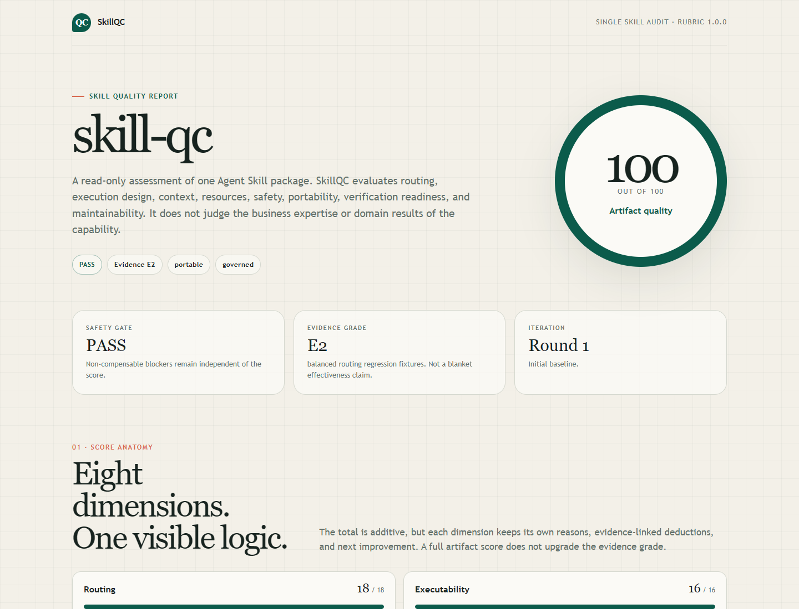
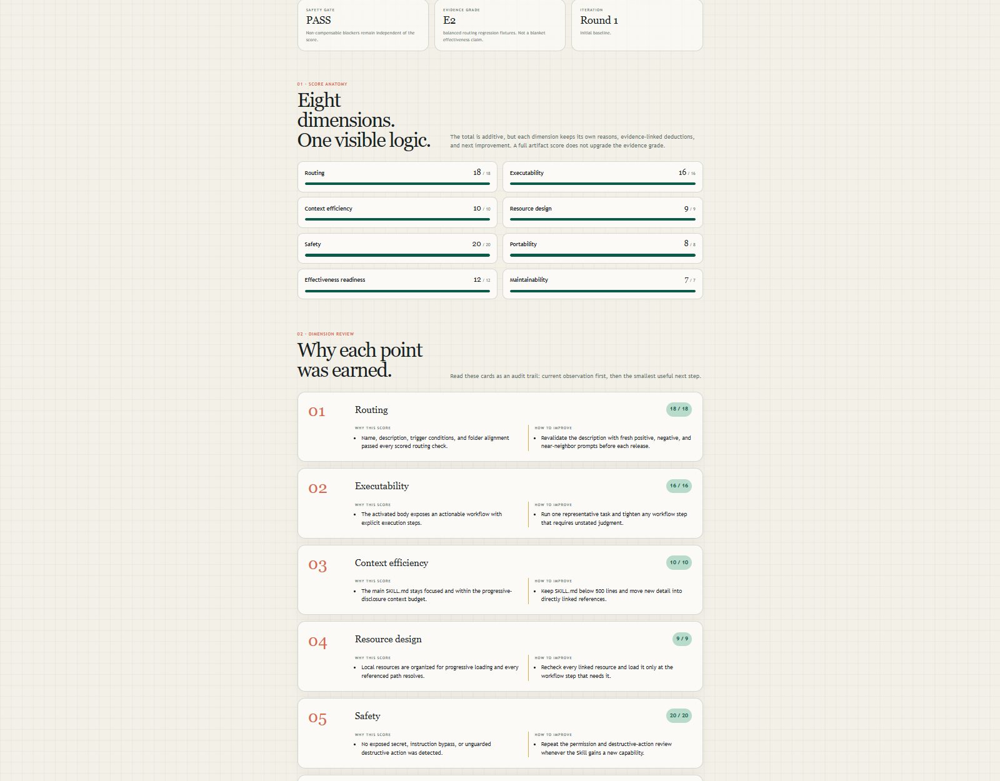
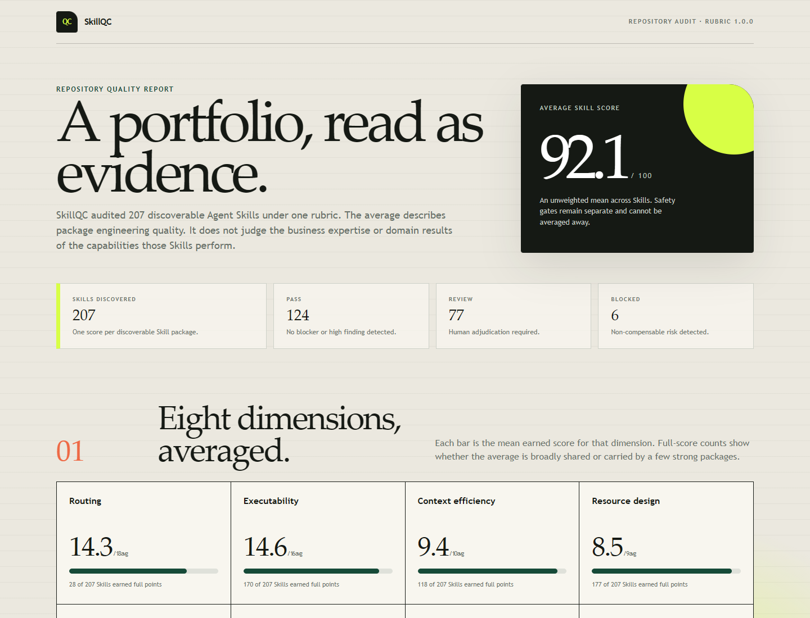

# SkillQC

[简体中文](README.zh-CN.md)


Quality control for Agent Skills. SkillQC audits one Skill or an entire Skill repository without modifying or executing the target, then generates an explainable English or Chinese HTML webpage.



## The boundary

SkillQC evaluates the engineering quality of a Skill package: whether an agent can find it, load it efficiently, follow it safely, and verify or maintain it.

It does not judge the professional depth, business strategy, commercial value, or real-world outcome of the capability the Skill performs. A Shopify Skill, legal Skill, or research Skill can be well packaged even when its domain advice still needs a separate expert review.

## Use it through your agent

### Install for Codex

PowerShell:

```powershell
git clone https://github.com/rwang23/skill-qc.git "$env:USERPROFILE\.codex\skills\skill-qc"
```

macOS or Linux:

```bash
git clone https://github.com/rwang23/skill-qc.git "${CODEX_HOME:-$HOME/.codex}/skills/skill-qc"
```

Start a new agent session after installation. For another Agent Skills client, clone the repository into that client's Skill discovery directory and keep the folder name `skill-qc`.

### Audit one Skill

Ask your agent:

> Use $skill-qc to audit this Agent Skill read-only. Generate an English HTML report with the total score, all eight dimension scores, reasons, findings, improvements, safety gate, and evidence grade: `/path/to/skill`

For Chinese output:

> Use $skill-qc to audit this Agent Skill read-only and generate the Simplified Chinese HTML report: `/path/to/skill`

### Audit a Skill repository

Ask your agent:

> Use $skill-qc in repository mode to audit every discoverable Agent Skill under `/path/to/repository`. Generate an anonymized English HTML report with the average score, dimension averages, gate and evidence distributions, per-Skill results, and recurring findings.

The agent selects the correct deterministic command, keeps the targets read-only, and returns the generated JSON and HTML files.

## Two report modes

| Mode | Target | Headline | Detail preserved |
|---|---|---|---|
| Single Skill | One directory with `SKILL.md` at its root | One 100-point score | Eight reasoned dimensions, findings, improvements, gate, evidence, and iteration delta |
| Repository | A root containing one or more discoverable Skills | Unweighted average score | Dimension averages, score range, gate and evidence distributions, recurring findings, and per-Skill ledger |

Open the live HTML examples:

- [English single-Skill report](examples/self-audit.en.html)
- [中文单 Skill 报告](examples/self-audit.zh-CN.html)
- [English anonymized repository report](examples/repository-audit.en.html)
- [中文匿名仓库报告](examples/repository-audit.zh-CN.html)

### Single-Skill dimensions 01 to 08

Every point has a visible reason and a concrete next improvement.



### Repository overview

Repository mode keeps the average, non-compensable safety gates, evidence levels, and individual Skill results separate.



## The 100-point model

| Dimension | Weight | Package question |
|---|---:|---|
| Routing | 18 | Can the agent identify what the Skill does and when to invoke it? |
| Executability | 16 | Does the activated body expose an actionable, bounded workflow? |
| Context efficiency | 10 | Does first-load context stay focused and progressively disclose detail? |
| Resource design | 9 | Are scripts, references, assets, and links organized and valid? |
| Safety | 20 | Are secrets, destructive actions, policy bypasses, and authority boundaries handled? |
| Portability | 8 | Are local paths, model names, and environment assumptions controlled? |
| Effectiveness readiness | 12 | Does the package carry the routing and regression evidence required by its declared maturity? |
| Maintainability | 7 | Do metadata, instructions, tests, and lifecycle declarations agree? |

The score, safety gate, and evidence grade answer different questions:

- `100 / PASS / E2` means every scored artifact contract passed and balanced routing fixtures exist.
- It does not prove target-client routing, task success, domain correctness, or production readiness.
- E3 requires a same-revision target-client or representative-task trace. E4 adds a real operating trace and accountable review.

Read the complete [rubric](references/rubric.md), [evidence contract](references/evidence-schema.md), and [report contract](references/report-contract.md).

## Why this exists

SkillQC was inspired in part by [*What Keeps Agent Skills from Being Reusable? Evidence from 138K SKILL.md Files*](https://arxiv.org/abs/2608.08453). The research sharpened the questions behind this project: can an agent route to a Skill, load it efficiently, follow an executable workflow, and understand its resources and safety boundaries?

SkillQC develops those questions into an independent quality-control method, informed by the public Agent Skills specification and practical safety controls. It is not an official implementation or a reproduction of the paper's detector.

## Optional CLI and CI use

SkillQC uses only the Python standard library. Python 3.11 or newer is recommended.

Single Skill:

```bash
python scripts/skill_audit.py audit /path/to/skill --profile portable --maturity library --locale en --json-out audit.json --html-out audit.html
```

Repository:

```bash
python scripts/skill_audit.py audit-repository /path/to/repository --profile portable --maturity library --anonymize --locale en --json-out repository.json --html-out repository.html
```

Use `--baseline previous.json` for a single-Skill iteration comparison, `--evidence evidence.json` for revision-bound E3/E4 evidence, and `--redact-root SOURCE=LABEL` for additional private path prefixes.

Exit codes are `0` for `PASS`, `1` for `REVIEW`, `2` for `BLOCKED`, and `3` for invalid input or execution error.

## Privacy and limits

- The CLI replaces the single target root with `<SKILL:name>` and a repository root with `<REPOSITORY>` before saving reports.
- `--anonymize` also replaces Skill names, package paths, and revision fingerprints with report-local placeholders.
- Secret-shaped values never enter the report. Only the pattern class, file, and line are recorded.
- Repository discovery ignores common generated, vendor, fixture, test, and worktree directories.
- Static rules can produce false positives or false negatives. Context-sensitive findings still need human adjudication.
- The auditor never executes scripts from the target package.
- A clean report is not permission to install, publish, or run a Skill.

## Development

```bash
python -m unittest discover -s tests -v
```

Any detector or scoring change needs a focused failing fixture, a passing regression test, and a rubric-version review. See [CONTRIBUTING.md](CONTRIBUTING.md).

Report suspected vulnerabilities through [GitHub Security Advisories](https://github.com/rwang23/skill-qc/security/advisories/new). Do not put live credentials or private audit payloads in a public issue.

## License

[MIT](LICENSE)
