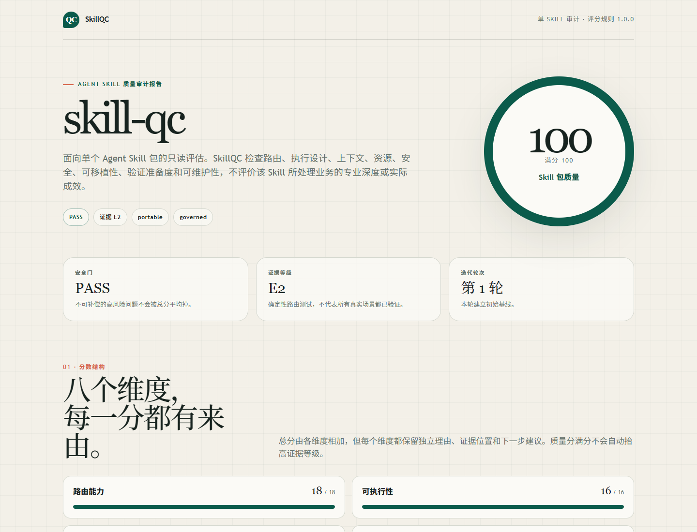
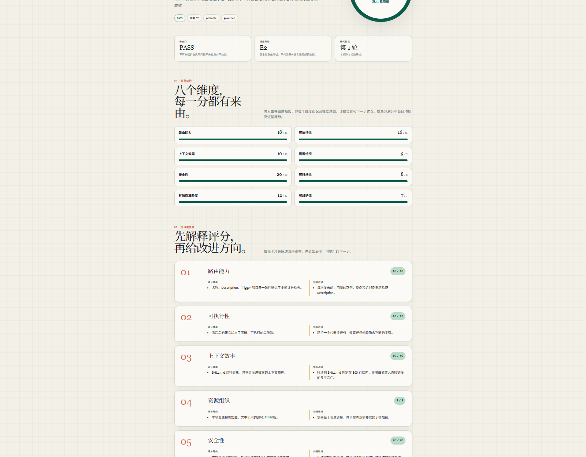
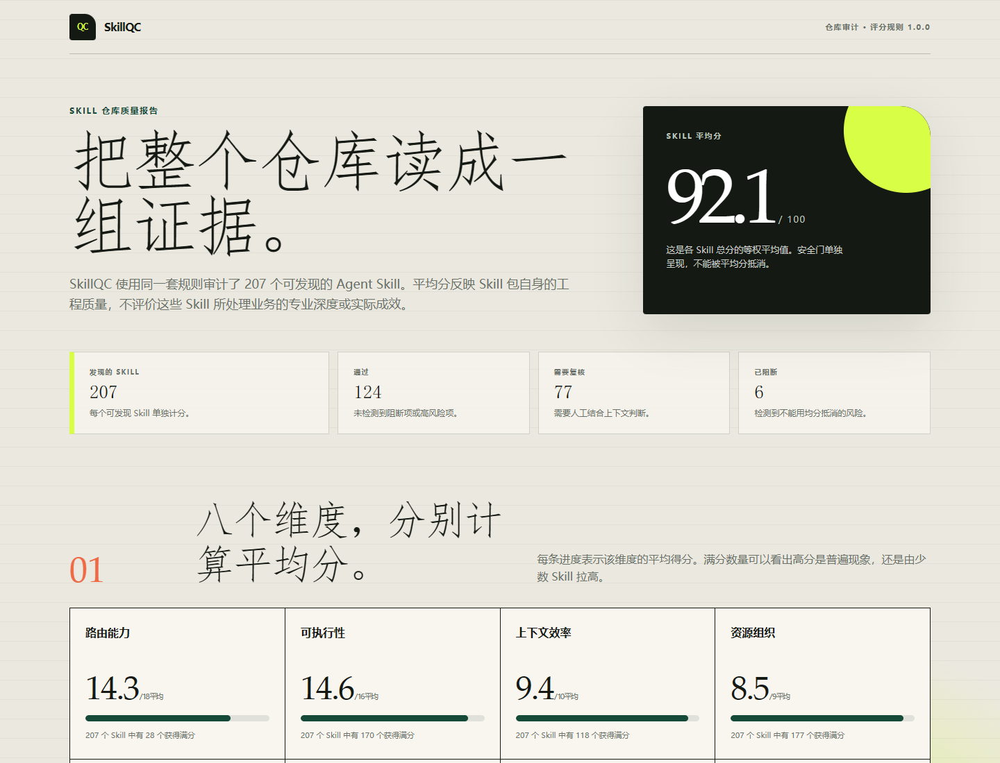

# SkillQC

[English](README.md)


SkillQC 是 Agent Skill 的质量检查工具。它可以审计一个 Skill，也可以审计整个 Skill 仓库。工具不会修改或执行目标，最终会生成一份可解释的中文或英文 HTML 网页报告。



## 评判边界

SkillQC 评估的是 Skill 包自身的工程质量：Agent 能不能找到它，能不能高效加载它，能不能安全执行其中的工作流，以及后续是否容易验证和维护。

它不评价这个 Skill 所处理业务的专业深度、策略优劣、商业价值或实际结果。一个 Shopify Skill、法律 Skill 或研究 Skill 即使结构和执行设计很好，其中的业务判断仍可能需要单独的专业审查。

## 直接交给 Agent 使用

### 安装到 Codex

PowerShell：

```powershell
git clone https://github.com/rwang23/skill-qc.git "$env:USERPROFILE\.codex\skills\skill-qc"
```

macOS 或 Linux：

```bash
git clone https://github.com/rwang23/skill-qc.git "${CODEX_HOME:-$HOME/.codex}/skills/skill-qc"
```

安装后新建一个 Agent 会话。其他支持 Agent Skills 的客户端，只需要把仓库克隆到对应的 Skill 发现目录，并保持文件夹名称为 `skill-qc`。

### 审计单个 Skill

直接告诉 Agent：

> 请使用 $skill-qc 对这个 Agent Skill 做只读审计，生成中文版 HTML 报告。报告需要包含总分、八个维度的评分和理由、问题、改进建议、安全门与证据等级：`/path/to/skill`

需要英文报告时：

> 请使用 $skill-qc 对这个 Agent Skill 做只读审计，并生成英文 HTML 报告：`/path/to/skill`

### 审计整个 Skill 仓库

直接告诉 Agent：

> 请使用 $skill-qc 的仓库模式，审计 `/path/to/repository` 下所有可发现的 Agent Skill。生成匿名中文版 HTML 报告，包含平均分、各维度平均分、安全门与证据分布、每个 Skill 的结果和重复出现的问题。

Agent 会选择对应的确定性命令，保持目标只读，并返回生成的 JSON 和 HTML 文件。

## 两种报告模式

| 模式 | 目标 | 首要结果 | 保留的细节 |
|---|---|---|---|
| 单 Skill | 根目录直接包含 `SKILL.md` 的一个文件夹 | 一个 100 分总分 | 八维评分理由、问题、改进建议、安全门、证据等级和迭代变化 |
| 仓库 | 包含一个或多个可发现 Skill 的根目录 | 各 Skill 总分的等权平均值 | 维度均分、分数区间、安全门和证据分布、重复问题及逐 Skill 清单 |

可以直接打开仓库中的网页示例：

- [英文单 Skill 报告](examples/self-audit.en.html)
- [中文单 Skill 报告](examples/self-audit.zh-CN.html)
- [英文匿名仓库报告](examples/repository-audit.en.html)
- [中文匿名仓库报告](examples/repository-audit.zh-CN.html)

### 单 Skill 的 01 到 08 维度

每一分都有理由，每个维度都有下一步改进建议。



### 仓库报告

仓库模式会把平均分、安全门、证据等级和每个 Skill 的结果分开呈现。



## 100 分评分模型

| 维度 | 权重 | 主要问题 |
|---|---:|---|
| 路由能力 | 18 | Agent 能否知道这个 Skill 做什么、什么时候应该调用？ |
| 可执行性 | 16 | Skill 激活后是否提供了可执行、有边界的工作流？ |
| 上下文效率 | 10 | 首次加载是否保持聚焦，详细信息是否按需披露？ |
| 资源组织 | 9 | 脚本、参考资料、资产和链接是否有效且组织合理？ |
| 安全性 | 20 | 凭据、破坏性操作、政策绕过和权限边界是否处理清楚？ |
| 可移植性 | 8 | 本地路径、模型名称和环境假设是否受控？ |
| 有效性准备度 | 12 | Skill 包是否具备当前成熟度所要求的路由和回归材料？ |
| 可维护性 | 7 | 元数据、正文、测试和生命周期说明是否一致？ |

总分、安全门和证据等级回答的是三个不同问题：

- `100 / PASS / E2` 表示所有计分契约都通过，并且具备均衡的路由测试集。
- 它不证明目标客户端一定能正确路由，也不证明任务成功、业务判断正确或已经达到生产要求。
- E3 需要同一版本的目标客户端记录或代表性任务记录；E4 还需要真实运行记录和责任人复核。

完整规则见[评分标准](references/rubric.md)、[证据契约](references/evidence-schema.md)和[报告契约](references/report-contract.md)。

## 为什么做 SkillQC

SkillQC 的灵感部分来自论文 [《What Keeps Agent Skills from Being Reusable? Evidence from 138K SKILL.md Files》](https://arxiv.org/abs/2608.08453)。这项研究帮助我们把问题问得更具体：Agent 能否找到一个 Skill、高效加载它、按可执行工作流完成任务，并理解其中的资源与安全边界？

SkillQC 在这些问题上继续发展，结合 Agent Skills 公开规范和实际安全控制，形成一套独立的质量检查方法。它不是论文检测器的官方实现，也不是对论文方法的直接复刻。

## 可选的 CLI 与 CI 用法

SkillQC 只依赖 Python 标准库，建议使用 Python 3.11 或更高版本。

单 Skill：

```bash
python scripts/skill_audit.py audit /path/to/skill --profile portable --maturity library --locale zh-CN --json-out audit.json --html-out audit.html
```

仓库：

```bash
python scripts/skill_audit.py audit-repository /path/to/repository --profile portable --maturity library --anonymize --locale zh-CN --json-out repository.json --html-out repository.html
```

单 Skill 可以使用 `--baseline previous.json` 比较前后两轮结果，使用 `--evidence evidence.json` 加入与当前版本绑定的 E3/E4 证据。额外的私有路径可以通过 `--redact-root SOURCE=LABEL` 替换。

退出码：`0` 表示 `PASS`，`1` 表示 `REVIEW`，`2` 表示 `BLOCKED`，`3` 表示输入无效或执行错误。

## 隐私与限制

- CLI 会在保存报告前，把单 Skill 根目录替换成 `<SKILL:name>`，把仓库根目录替换成 `<REPOSITORY>`。
- `--anonymize` 还会把 Skill 名称、包路径和版本指纹替换为报告内部占位符。
- 疑似凭据的具体值不会进入报告，只记录模式类别、文件和行号。
- 仓库发现会跳过常见的生成目录、供应商目录、测试夹具、测试目录和 worktree。
- 静态规则可能误报或漏报。与上下文有关的问题仍需要人工判断。
- 审计器不会执行目标 Skill 包中的脚本。
- 报告干净不代表已经获得安装、发布或执行权限。

## 开发

```bash
python -m unittest discover -s tests -v
```

任何检测规则或计分变化，都需要一个先失败的聚焦用例、修复后通过的回归测试，以及评分规则版本复核。具体见 [CONTRIBUTING.md](CONTRIBUTING.md)。

疑似安全漏洞请通过 [GitHub Security Advisories](https://github.com/rwang23/skill-qc/security/advisories/new) 报告。不要在公开 Issue 中提交真实凭据或私有审计内容。

## 许可证

[MIT](LICENSE)
